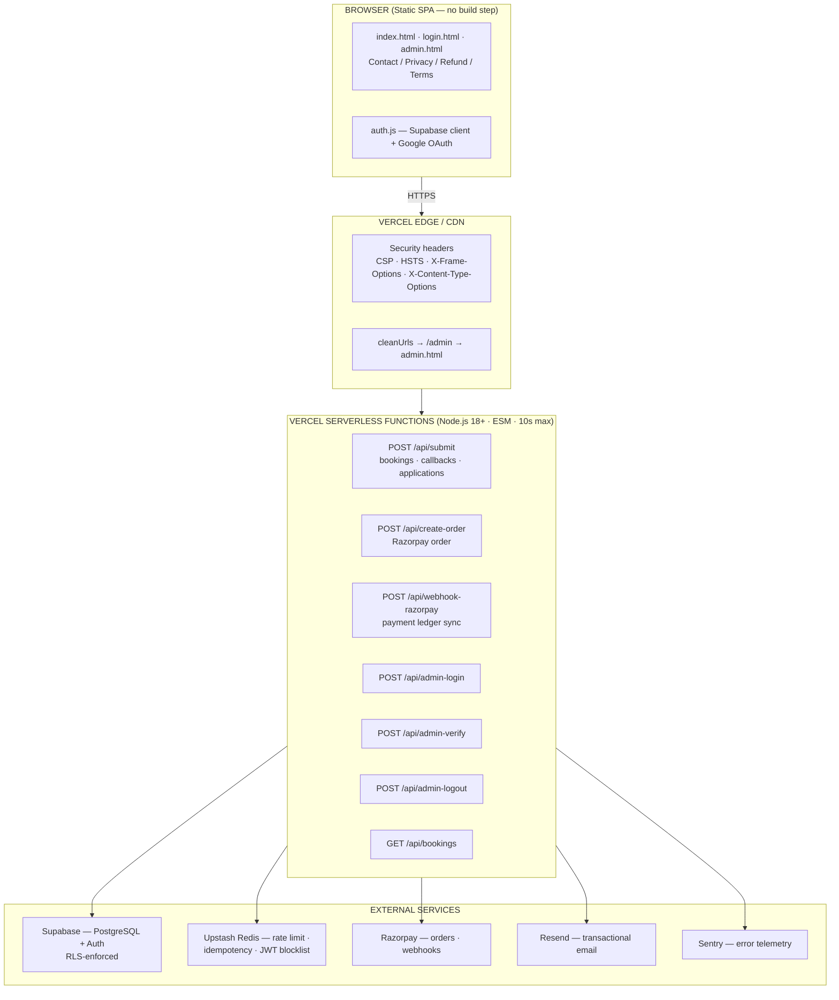
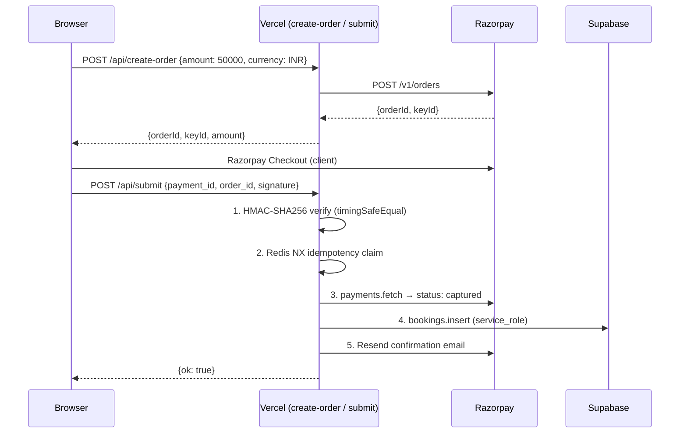
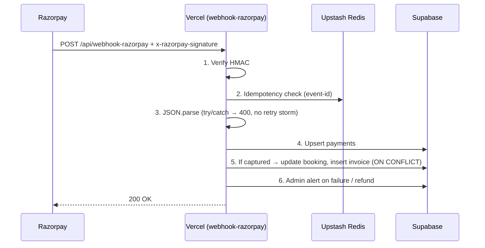
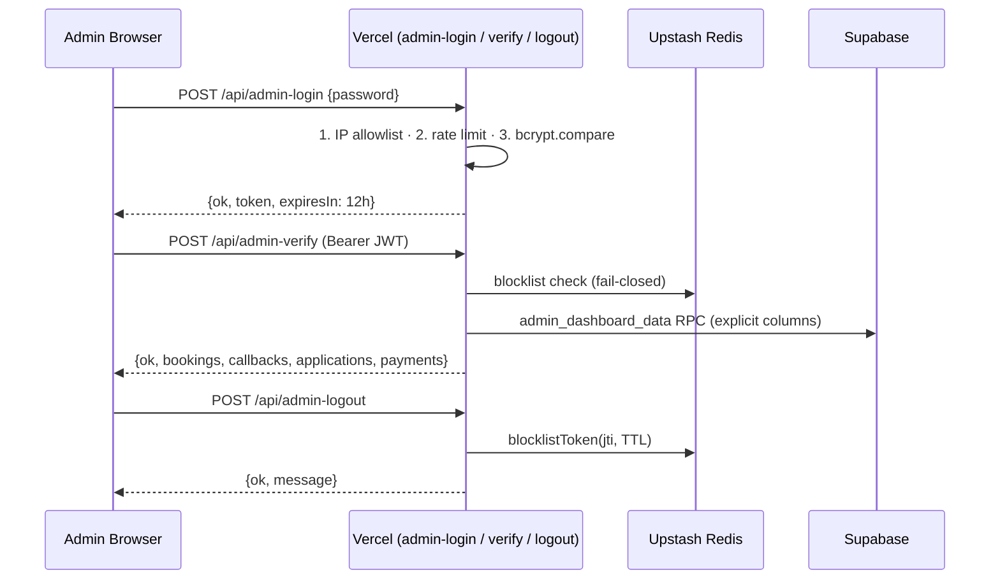

<div align="center">

# CareConnect360

### Premium, Verified At-Home Nursing & Healthcare Services Across India

**CareConnect360** is a production-hardened healthcare booking and payment platform that connects patients with
verified nurses within hours — powered by a zero-trust serverless architecture on **Vercel** and **Supabase**.

<br/>

[](https://careconnect360.in)
[](https://supabase.com/docs/guides/database/postgres/row-level-security)
[](https://sentry.io)
[](https://nodejs.org)
[](https://vercel.com)
[](https://razorpay.com)
[](#careconnect360)

**Status:** 🚀 Going Live — Production | **Version:** 1.0.0 | **Last Updated:** 2026-08-01

</div>

---

## 📋 Table of Contents

- [1. Executive Overview](#-1-executive-overview)
- [2. Architecture & Tech Stack](#-2-architecture--tech-stack)
- [3. Security & Serverless Hardening](#-3-security--serverless-hardening)
- [4. Data Flow](#-4-data-flow)
- [5. Local Development & Deployment](#-5-local-development--deployment)
- [6. Support & Operations](#-6-support--operations)

---

## 🏥 1. Executive Overview

CareConnect360 is a **healthcare booking and payment platform** for India. Patients pay a flat **₹500 booking fee**
via Razorpay, request callback consultations, or apply to join the care network as nurses — while admins manage the
entire operation from a JWT-protected dashboard.

| | |
|---|---|
| **Mission** | Deliver premium, verified at-home nursing care with a sub-4-hour booking-to-assignment SLA. |
| **Booking Model** | ₹500 upfront booking fee via Razorpay Checkout (`.create-order` → HMAC-verified `.submit` → ledger-synced `.webhook`). |
| **Platform** | Zero-build static frontend + 7 ESM serverless functions on Vercel, PostgreSQL on Supabase. |
| **Security Posture** | Zero-trust Row-Level Security (RLS), hash-based Content Security Policy, IP-allowlisted admin auth, fail-closed JWT revocation. |
| **Observability** | Severity-mapped structured logging with graceful Sentry telemetry — telemetry can **never** take down the app. |

### Key Performance & Reliability Characteristics

- **⚡ < 4 hours** — verified nurse deployment SLA after payment confirmation.
- **🔐 Zero-trust by default** — every table enforces `auth.role() = 'authenticated'` RLS; the client has no write path to business data.
- **🛡️ 7 critical/high severity findings closed** in a single 21-task audit remediation pass (Phase 0–3).
- **⏱️ Bounded execution** — 5 s hard timeouts on every external I/O call (`withTimeout`), 10 s serverless ceiling (`maxDuration`).
- **📈 100% additive migrations** — 8 timestamped, never-edited Supabase migrations from baseline to go-live.
- **♻️ Idempotent by design** — Redis NX claims, webhook event-id dedupe, and race-safe invoice `ON CONFLICT`.

---

## 🧩 2. Architecture & Tech Stack

### System Topology



### 🎨 Frontend

Vanilla HTML5 + a hand-tuned CSS design system (Apple × Stripe × Google Health aesthetic). **Zero build step** — files
are served directly from the project root via Vercel `cleanUrls`.

| Route | File | Purpose |
|-------|------|---------|
| `/` | `index.html` | Landing, booking form, callback form, nurse application |
| `/login` | `login.html` | Google OAuth login via Supabase |
| `/admin` | `admin.html` | JWT-protected admin dashboard (paginated bookings, callbacks, applications, payments) |
| `/Contact` | `Contact.html` | Contact information |
| `/PrivacyPolicy` | `PrivacyPolicy.html` | Privacy policy |
| `/Refund` | `Refund.html` | Refund policy |
| `/Terms-Conditions` | `Terms-Conditions.html` | Terms & conditions |

- **Auth (`auth.js`)** — Supabase client with `window.SUPABASE_URL` / `window.SUPABASE_ANON_KEY`, Google OAuth via
  `signInWithGoogle()`, role-based routing (`routeAfterLogin()`), and `requireAuth(expectedRole)` session guards.
- **Telemetry** — Sentry browser SDK loaded from CDN with `sentry.js` initializing a unified scope (`beforeSend`
  suppresses `localhost` / `github.dev` events).
- **CSP compliance** — all `<script>` blocks are inline and authorized by **SHA-256 hashes**, never `'unsafe-inline'`.

### 🧮 Backend & Serverless

Seven ESM serverless functions in `/api/` — each with module-scope env validation, exact-match CORS, Upstash rate
limiting (sliding window), structured logging, and **strict async/await lifecycle boundaries** with **5 s timeouts**
(`withTimeout`) on every external I/O call, capped by a **10 s** serverless `maxDuration`.

| Endpoint | Method | Auth | Purpose |
|----------|--------|------|---------|
| `/api/submit` | POST | CORS + rate limit | Bookings (Razorpay **HMAC-SHA256** verify via `timingSafeEqual`), callbacks, nurse applications → Supabase + Resend |
| `/api/create-order` | POST | CORS + rate limit + idempotency | Creates Razorpay payment orders |
| `/api/webhook-razorpay` | POST | HMAC signature | Verifies `x-razorpay-signature`, syncs payment ledger, creates invoices, alerts admins |
| `/api/admin-login` | POST | IP allowlist + rate limit | bcrypt verify → HS256 JWT (12 h, `jti` claim) |
| `/api/admin-verify` | POST | JWT + IP allowlist + blocklist | Session validation + paginated `admin_dashboard_data` RPC |
| `/api/admin-logout` | POST | JWT + IP allowlist | Revokes JWT via Redis blocklist (`jti` + TTL) |
| `/api/bookings` | GET | Supabase session token | Customer bookings via caller's session — **RLS enforces isolation** |

**Shared libraries (`/lib`):**

| File | Purpose |
|------|---------|
| `redis-blocklist.js` | JWT revocation via Upstash Redis — **fail-closed** (`return true` on any Redis error) |
| `logger.js` | Structured JSON logger with severity-mapped Sentry forwarding (`ERROR → error`, `CRITICAL → fatal`) |
| `security-utils.js` | `hashPII`, `extractIP` (`.pop()` of `x-forwarded-for`), `validateAmount`, `validateCurrency`, `withTimeout` |

### 🗄️ Database & Security

**Supabase PostgreSQL** (`careconnect360-staging`) — 7 tables with strict, role-restricted **Row-Level Security**
(`auth.role() = 'authenticated'`, `auth.uid() = customer_id`) and a server-side `service_role` that bypasses RLS only
inside trusted handlers.

| Table | Row-Level Security |
|-------|--------------------|
| `profiles` | Owner-only read/update (`auth.uid() = id`) |
| `bookings` | Customer/nurse **SELECT-only** via RLS; INSERT/UPDATE/DELETE **deny-all** for the client |
| `payments` | **Deny-all** for anon/authenticated — server-side writes only |
| `invoices` | Customer read-only (`auth.uid() = customer_id`) |
| `nurses` | Authenticated read-only (`profile_id = auth.uid()`) |
| `callbacks` / `applications` | **Deny-all client INSERT** (`WITH CHECK (false)`) — service-role writes only |

**Defense-in-depth extras:** role-escalation guard trigger (`trg_prevent_self_role_escalation`), auto-RLS event
trigger, `admin_dashboard_data` RPC as `SECURITY DEFINER` with explicit column lists (revoked from `public` /
`anon` / `authenticated`), and `pg_stat_statements` / `pgcrypto` / `supabase_vault` / `uuid-ossp` extensions.

### 📡 Telemetry & Logging

| Severity | Console (structured JSON) | Sentry |
|----------|---------------------------|--------|
| `INFO` / `WARN` | ✅ `console.log` | — |
| `ERROR` | ✅ | ✅ `captureMessage` → level `error` |
| `CRITICAL` | ✅ | ✅ `captureMessage` → level `fatal` |

Sentry is **graceful by design**: if `SENTRY_DSN` is absent, the logger emits one WARN and all captures become
no-ops — **telemetry can never take down the application**. On the client, `sentry.js` adds a production browser
scope (`tracesSampleRate: 0.1`) to the CDN loader.

---

## 🔒 3. Security & Serverless Hardening

### Zero-Trust Row-Level Security

```sql
-- The client-facing surface is SELECT-only and owner-scoped:
create policy "owner access" on public.bookings
  for select to authenticated
  using (auth.uid() = customer_id);

-- Business writes exist ONLY behind service_role (serverless handlers):
-- bookings  → deny-all INSERT/UPDATE/DELETE for anon/authenticated
-- payments  → deny-all for anon/authenticated
-- callbacks → INSERT denied with CHECK (false)
-- applications → INSERT denied with CHECK (false)
```

> RLS permissive policies are OR'ed — adding a `WITH CHECK (false)` deny policy alone **does not** revoke an existing
> grant. The residual permissive "Public can submit" policies were **dropped** (migration `20260801000000`) so the
> deny policies are the only ones that remain.

### Content Security Policy (vercel.json)

Applied to every route via the `/(.*)` source pattern — whitelist-only resource loading:

| Header | Value |
|--------|-------|
| **Content-Security-Policy** | `default-src 'self'`; `script-src` = 4 × `sha256-…` + Razorpay + Sentry CDN; `connect-src` = Supabase, Razorpay, Sentry ingest only (+ `wss://` Realtime); `frame-src` = Razorpay checkout; `worker-src 'self' blob:` |
| **Strict-Transport-Security** | `max-age=63072000; includeSubDomains; preload` |
| **X-Frame-Options** | `DENY` |
| **X-Content-Type-Options** | `nosniff` |
| **Referrer-Policy** | `strict-origin-when-cross-origin` |
| **Permissions-Policy** | `camera=(), microphone=(), geolocation=()` |

**Route-specific:** `/api/webhook-razorpay`, `/admin`, and `/login` are served `no-store, no-cache, must-revalidate,
private` (webhook responses also `X-Robots-Tag: noindex, nofollow`).

### Guaranteed Execution Bounds

| Boundary | Enforced At | Value |
|----------|-------------|-------|
| External I/O timeout | `withTimeout()` in `security-utils.js` | **5 s** per call |
| Function ceiling | `vercel.json → functions.api\/*.js.maxDuration` | **10 s** |
| Rate limiting | Upstash Redis sliding window | 5 requests / 5 minutes |
| JWT lifetime | `jsonwebtoken` | 12 h (HS256, `jti` claim) |
| Admin access | IP allowlist | `ADMIN_ALLOWED_IPS` (comma-separated, or `*`) |

### Audit Remediation at a Glance

21 tasks from the 2026-07-23 security audit were remediated in strict severity order (Phases 0–3), including:
**critical** — real JWT logout via Redis blocklist, wildcard-CORS elimination, server-side Razorpay HMAC verification,
deny-all RLS write policies, and webhook 400-not-500 on malformed bodies; **high** — fail-closed blocklist reads,
trustworthy `x-forwarded-for` extraction, and hash-based CSP (no `'unsafe-inline'`).

---

## 🔁 4. Data Flow

### Booking Payment Flow



### Webhook Reconciliation Flow



### Admin Auth Flow



---

## 🚀 5. Local Development & Deployment

### Prerequisites

- **Node.js 18+** and `npm`
- Accounts: [Vercel](https://vercel.com), [Supabase](https://supabase.com), [Razorpay](https://razorpay.com),
  [Upstash](https://upstash.com), [Resend](https://resend.com), [Sentry](https://sentry.io)

### 1. Clone & Install

```bash
git clone https://github.com/spartanfromk-18/Careconnect360.in.git
cd Careconnect360.in
npm install
```

### 2. Configure Environment

```bash
cp .env.example .env
```

Populate `.env` from the template (`.env` is gitignored). Every required variable is **validated at module load** —
a missing secret aborts deployment instead of silently serving broken traffic. Key variables:

| Variable | Purpose |
|----------|---------|
| `ALLOWED_ORIGIN` / `ALLOWED_PREVIEW_ORIGINS` | Exact-match CORS origins (no wildcards) |
| `SUPABASE_URL` / `SUPABASE_SERVICE_ROLE_KEY` / `SUPABASE_ANON_KEY` | Supabase clients (service key is **server-side only**) |
| `RAZORPAY_KEY_ID` / `RAZORPAY_KEY_SECRET` / `RAZORPAY_WEBHOOK_SECRET` | Razorpay payments + HMAC verification |
| `UPSTASH_REDIS_REST_URL` / `UPSTASH_REDIS_REST_TOKEN` | Rate limiting, idempotency, JWT blocklist |
| `RESEND_API_KEY` / `SENDER_EMAIL` / `ADMIN_EMAIL` | Transactional email + admin alerts |
| `JWT_SECRET` / `ADMIN_PASSWORD_HASH` / `ADMIN_ALLOWED_IPS` | Admin auth (JWT ≥ 32 chars, bcrypt hash, IP allowlist) |
| `SENTRY_DSN` | Error telemetry (optional — degrades gracefully) |

> Generate secrets:
> ```bash
> openssl rand -base64 48                      # JWT_SECRET
> node -e "console.log(require('bcryptjs').hashSync('YOUR_PASSWORD', 10))"   # ADMIN_PASSWORD_HASH
> ```

### 3. Verify Locally

```bash
# Syntax-check every serverless handler and shared module
for f in api/*.js lib/*.js; do node --check "$f"; done

# Frontend HTML structure validation (per CI)
grep -rl "<!DOCTYPE html>" *.html | wc -l

# Pre-commit verification gate (lint / build / tests / CodeRabbit)
./verify.sh
```

> The API is a static + serverless build — `npm run build` is a no-op stub and `npm start` is informational. The
> true local checks are `node --check` on `api/` + `lib/` and HTML validation.

### 4. Deploy to Vercel Production

```bash
vercel login
vercel           # Preview deployment → https://careconnect360-<ref>.vercel.app
vercel --prod    # Production deployment → https://careconnect360.in
```

Then, in the **Vercel Dashboard → Project Settings → Environment Variables**, set every value from `.env` for
**Production, Preview, and Development**. A broken deployment with missing secrets fails fast at module load.

### CI/CD Pipeline

The documented GitHub Actions pipeline runs six jobs in parallel — **Supply Chain Security** (`npm audit`),
**Secrets Scanning** (Gitleaks, full history), **CodeQL Analysis**, **Frontend Quality** (`node --check` + HTML
validation + production-secret grep), **Lighthouse CI** (performance / accessibility / SEO), and an aggregated
**Deployment Readiness** gate — with `cancel-in-progress` concurrency.

---

## 🆘 6. Support & Operations

| Channel | Contact |
|---------|---------|
| **Website** | [careconnect360.in](https://careconnect360.in) |
| **Support Email** | [careconnect.in.help@gmail.com](mailto:careconnect.in.help@gmail.com) |
| **Phone** | [+91 97604 90640](tel:+919760490640) |
| **Repository** | [github.com/spartanfromk-18/Careconnect360.in](https://github.com/spartanfromk-18/Careconnect360.in) |

**Monitoring & Dashboards**
- **Sentry** — production error telemetry: `https://sentry.io/organizations/<your-org>/issues/?environment=production`
- **Vercel** — deployment status, function logs, and serverless analytics: `https://vercel.com/<team>/careconnect360`
- **Supabase** — database health, RLS verification, and query performance: `https://supabase.com/dashboard/project/careconnect360-staging`
- **Upstash** — rate-limit & blocklist usage: `https://console.upstash.com`
- **Razorpay** — payment & webhook logs: `https://dashboard.razorpay.com`

**Source of truth for architecture & remediation:** [`ARCHITECTURE_AND_DEPLOYMENT.md`](ARCHITECTURE_AND_DEPLOYMENT.md)

---

<div align="center">

**CareConnect360 · © 2026 · All Rights Reserved**

Built with ❤️ for caregivers and patients across India. **Healthcare, hardened by default.**

</div>

